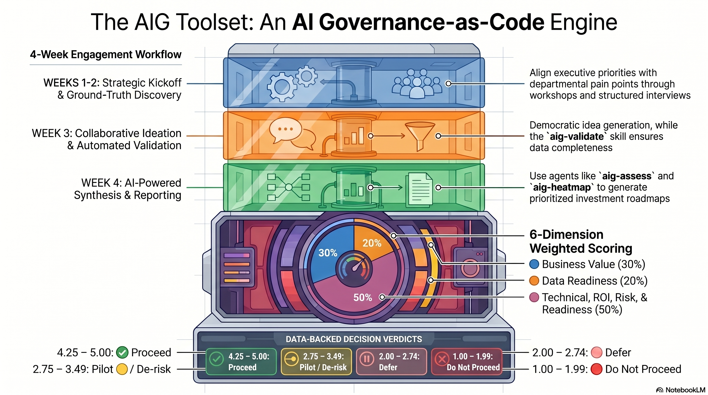

<p align="center">
  
  
  
</p>

<h1 align="center">AIG Discovery Toolset</h1>
<p align="center"><strong>AI Discovery & Governance for Enterprise Transformation</strong></p>

<p align="center">
  
  
  
  
  
  
  
</p>

---

> [!WARNING]
> **🧪 Experimental — Under Active Testing**
> This toolset is in its early experimental phase. Templates, scoring weights, agent skills, and engagement workflows are being actively tested and refined. Expect breaking changes. Feedback and field-test results are welcome.

---

## 🔎 What Is This?

The AIG Toolset is a **"Governance as Code"** repository. It provides everything a consultant or EA team needs to walk into an organization, assess where AI can create the most value, and produce actionable, data-backed recommendations — all using version-controlled Markdown files analyzed by AI agent skills.

## 👥 Who Is This For?

| Role | What you get |
|---|---|
| **Consultant / Enterprise Architect** | Step-by-step playbooks, structured templates, and AI agent skills to run a complete AI readiness assessment |
| **C-Suite / Executive Sponsor** | Clear, visual outputs — heatmaps, scorecards, and executive summaries that drive investment decisions |
| **Department Heads & Team Leads** | Simple templates to describe your team, processes, and pain points — no technical knowledge required |
| **Any Employee** | A straightforward way to propose AI ideas and have them evaluated fairly |

## 📂 Repository Structure

```
aig-toolset/
├── docs/guidelines/          # Consultant playbooks (how to run workshops, interviews, synthesis)
├── templates/                # Standardized Markdown templates with YAML frontmatter
├── tracker/                  # Per-engagement working directory
│   └── pillars/*/sources/    #   Raw docs shared by teams + interview notes
│   └── pillars/*/teams/      #   Silver layer: structured team cards, capabilities, ideas
├── skills/                   # Agent skills (skills.sh) for validation, scoring, and visualization
└── PROJECT_PLAN.md           # Implementation tracker
```

## 🚀 Quick Start

### For Consultants — Starting a New Engagement

1. **Read the guidelines** — start with `docs/guidelines/01-engagement-kickoff.md`
2. **Copy templates** — duplicate the blank templates from `templates/` into your `tracker/pillars/` structure
3. **Run workshops** — follow the guideline playbooks to gather data from the client
4. **Validate data** — use the `aig-validate` agent skill to check completeness
5. **Score opportunities** — use the `aig-assess` skill to generate draft scorecards
6. **Generate reports** — use `aig-heatmap` and `aig-matrix` to produce executive deliverables

### For Team Leads — Contributing Your Team's Data

1. Open the `templates/team-card.md` file
2. Fill in the YAML frontmatter fields (team name, tech stack, pain points, etc.)
3. Write a brief narrative in the body sections
4. Save the file to `tracker/pillars/<your-pillar>/teams/<your-team>-team-card.md`

### For Anyone — Proposing an AI Idea

1. Open the `templates/ai-use-idea.md` file
2. Describe the problem, your proposed AI solution, and the expected impact
3. Save to `tracker/pillars/<relevant-pillar>/ideas/<idea-name>.md`

## 📊 The Assessment Framework

All scoring is based on the **AI Opportunity Assessment Framework**, which evaluates ideas across **6 weighted dimensions**:

| # | Dimension | Weight | What it measures |
|:---:|---|:---:|---|
| 1 | **Business Value & Strategic Fit** | 30% | Impact, strategic alignment, scalability, time-to-value, user desirability |
| 2 | **Data Readiness & Availability** | 20% | Data existence, volume, quality, governance |
| 3 | **Technical Feasibility & Architecture Fit** | 15% | Solution maturity, integration complexity, infrastructure |
| 4 | **Cost, Effort & ROI** | 15% | CAPEX, OPEX, payback period, change burden |
| 5 | **Risk & Ethical Profile** | 10% | Regulatory, output quality, privacy, adoption resistance, explainability & fairness |
| 6 | **Organisational & Change Readiness** | 10% | Executive sponsorship, talent, culture, governance |

Each criterion is scored **1–5** and combined into a weighted total. The result drives a clear verdict:

| Score | Verdict |
|:---:|---|
| 4.25 – 5.00 | ✅ **Proceed** |
| 3.50 – 4.24 | 🟢 **Proceed with conditions** |
| 2.75 – 3.49 | 🟡 **Pilot / de-risk first** |
| 2.00 – 2.74 | 🟠 **Defer** |
| 1.00 – 1.99 | 🔴 **Do not proceed** |

## 🤖 Agent Skills

| Skill | Purpose |
|---|---|
| `aig-interview` | Ingests raw documents & interview transcripts → structured silver-layer Markdown |
| `aig-validate` | Checks completeness and consistency of all tracker data |
| `aig-assess` | Scores AI ideas across the 6-dimension framework → draft scorecards |
| `aig-heatmap` | Generates visual heatmaps for executive-level prioritization |
| `aig-matrix` | Produces cross-referencing matrices (capability × technology, team × idea) |

## 🗓️ The Engagement — How It Works

The AIG assessment follows a **4-week engagement model** designed around one principle: **the best AI insights come from the people closest to the work**. The methodology moves from strategic context → ground-truth data → creative ideation → data-driven decisions, with AI agent skills accelerating analysis at every stage.

<p align="center">
  
</p>

<details>
<summary>📋 Text version of the workflow</summary>

```
  Week 1                Week 2                Week 3                Week 4
┌──────────┐     ┌───────────────┐     ┌──────────────┐     ┌──────────────────┐
│ KICKOFF  │ ──▸ │  DISCOVERY    │ ──▸ │  IDEATION    │ ──▸ │  SYNTHESIS       │
│          │     │               │     │              │     │                  │
│ Align    │     │ Interview     │     │ Workshop     │     │ Score · Rank     │
│ Scope    │     │ Map           │     │ Propose      │     │ Visualize        │
│ Charter  │     │ Capture       │     │ Submit       │     │ Present          │
└──────────┘     └───────────────┘     └──────────────┘     └──────────────────┘
```

</details>

---

### Week 1 · Engagement Kickoff

> **Goal:** Align expectations, establish trust, and prepare the ground for honest data collection.

The engagement begins with a **kickoff meeting** between the consultant, executive sponsor, and project coordinator. The focus is not on AI yet — it's on **setting the right tone**. Teams need to know this is a conversation, not an audit; that their data won't be used for performance evaluation; and that every voice matters.

| Activity | Output | Guideline |
|---|---|---|
| Kickoff meeting with sponsor | Agreed scope, schedule, communication plan | [01-engagement-kickoff.md](docs/guidelines/01-engagement-kickoff.md) |
| Executive workshop (2h) | Filled `company-profile.md` — strategic priorities, AI maturity, budget, risk appetite | [02-executive-workshop.md](docs/guidelines/02-executive-workshop.md) |
| Ethical AI charter session | Signed ethical principles — no surveillance, transparency, voluntary participation | [05-ethical-ai-charter.md](docs/guidelines/05-ethical-ai-charter.md) |

**The executive workshop** captures what leadership sees from the top: strategic direction, competitive pressure, regulatory exposure, and their honest self-assessment of AI readiness. But the real insight comes from how they talk about AI — their disagreements, their body language, and the gap between aspiration and action.

---

### Week 2 · Department Discovery

> **Goal:** Map the real world — processes, pain points, data, and people — team by team.

This is where the **real data lives**. While executives provide strategic context, team leads and their people know what actually happens day-to-day: the workarounds, the spreadsheets that hold everything together, the tasks that eat 20 hours a week, and the data quality nobody talks about.

**How it works:**

1. **45-minute interviews** with each team lead (+ 1–2 senior members), structured around:
   - *What does your team actually do?* — daily workflows, dependencies, handoffs
   - *Where does time disappear?* — repetitive tasks, error-prone processes, manual data entry
   - *What data do you work with?* — systems, quality, ownership, gaps
   - *How does your team feel about AI?* — excitement, fear, prior experience

2. **Raw materials go into `sources/`** — shared documents (Excel, Word, PDF, PPT), interview notes, whiteboard photos, transcriptions

3. **The `aig-interview` skill translates** raw sources into structured silver-layer Markdown — drafting `team-card.md` and `business-capability.md` files with filled YAML frontmatter

4. **The consultant reviews and adjusts** — adding cultural observations, correcting AI openness scores based on body language, and flagging gaps

| Activity | Output | Guideline |
|---|---|---|
| Team-by-team interviews (45–60 min each) | `team-card.md` + `business-capability.md` per team | [03-department-discovery.md](docs/guidelines/03-department-discovery.md) |
| Raw document collection | `sources/` folder with shared docs + notes | — |
| Silver-layer translation | Structured, validated Markdown via `aig-interview` | — |

> 💡 **Key principle:** *"This is a conversation, not an interrogation."* The best data comes from people who feel heard, not studied. The facilitator walks in with empathy, asks about what the team is proud of first, and only then pivots to pain points.

---

### Week 3 · AI Ideation Workshop

> **Goal:** Give everyone — not just managers or technologists — a chance to propose where AI could help.

The ideation workshop is the most **democratic** part of the assessment. The best AI ideas often come from the person doing the same data entry 40 times a week, not from the boardroom.

**Workshop flow (90 min in-person):**

1. **Ice-breaker** — *"You already use AI"* — show that spell-check, smart replies, and Google Maps are all AI. Normalize the concept.
2. **Brainstorming prompts** — "What task do you do over and over that feels like a robot could do it?" / "If AI gave you back 5 hours a week, what would you do with that time?"
3. **Sticky note ideation** — one idea per note: Problem → AI Could → Impact
4. **Table clustering** — small groups merge similar ideas
5. **Dot voting** — everyone votes for what would make the biggest difference to *their* work
6. **Async window (1 week)** — for ideas that come later, or from people too shy to speak up in a group

| Activity | Output | Guideline |
|---|---|---|
| Live workshop (in-person or virtual) | Clustered, voted ideas from cross-functional groups | [04-ai-ideation-workshop.md](docs/guidelines/04-ai-ideation-workshop.md) |
| Async submission window | Additional `ai-use-idea.md` submissions over 1 week | — |
| Idea conversion | Structured `ai-use-idea.md` per viable idea | — |

> 💡 **Key principle:** *"Every idea is valid. 'I wish someone could sort my emails' is just as valuable as 'We should build a predictive churn model.'"*

---

### Week 4 · Synthesis & Reporting

> **Goal:** Turn raw data into scored, ranked, visualized recommendations that drive investment decisions.

This is where **AI agent skills take center stage**. The consultant has gathered team cards, capability maps, and AI use ideas across the organization. Now the toolset processes them:

```
  Sources ──▸ aig-validate ──▸ aig-assess ──▸ aig-heatmap ──▸ Executive
  (raw)       (check)          (score)        (visualize)      Readback
```

| Step | Agent Skill | What it does |
|---|---|---|
| **1. Validate** | `aig-validate` | Checks all YAML fields, cross-references, and narrative completeness. Flags gaps for follow-up. |
| **2. Score** | `aig-assess` | Scores each AI idea across the 6-dimension weighted framework. Generates draft scorecards with evidence statements. |
| **3. Visualize** | `aig-heatmap` | Produces a Teams × Dimensions heatmap, executive summary, and top-3 opportunities / blockers. |
| **4. Cross-reference** | `aig-matrix` | Generates TOGAF matrices (Capability → App → Data → Technology) and gap analysis. |
| **5. Prioritize** | Consultant | Plots ideas on a Value vs. Effort matrix → Quick Wins, Strategic Bets, Defer. Builds a phased roadmap. |

**The consultant reviews every score** — agent outputs are starting points, not final answers. The consultant adjusts for political dynamics, unwritten constraints, and the body-language signals no document captures.

**The executive readback (1 hour)** tells the story:

- 🗺️ The heatmap — where the organization is strong and where it's weak
- 🏆 Top opportunities — with radar charts, scorecards, and clear verdicts
- ⚠️ Key risks — and what to do about them
- 🗓️ A phased roadmap — Wave 1 quick wins → Wave 2 strategic pilots → Wave 3 scale

| Activity | Output | Guideline |
|---|---|---|
| Data validation + scoring | Scorecards in `tracker/scorecards/` | [06-assessment-synthesis.md](docs/guidelines/06-assessment-synthesis.md) |
| Heatmap + matrix generation | `tracker/reports/` — heatmap, executive summary, TOGAF matrices | — |
| Executive presentation | Prioritized roadmap, investment recommendations, decision points | — |

📖 **Read the full story:** [The AIG Journey: A Narrative Guide to AI Adoption](docs/AIG_JOURNEY.md) — Follow an Enterprise Architect from kickoff to final executive readback using the AIG toolset.

---

<p align="center">
  <sub>Built with ❤️ for consultants who believe AI governance should be data-driven, repeatable, and transparent.</sub>
</p>

## License

This toolset is proprietary. All rights reserved.
