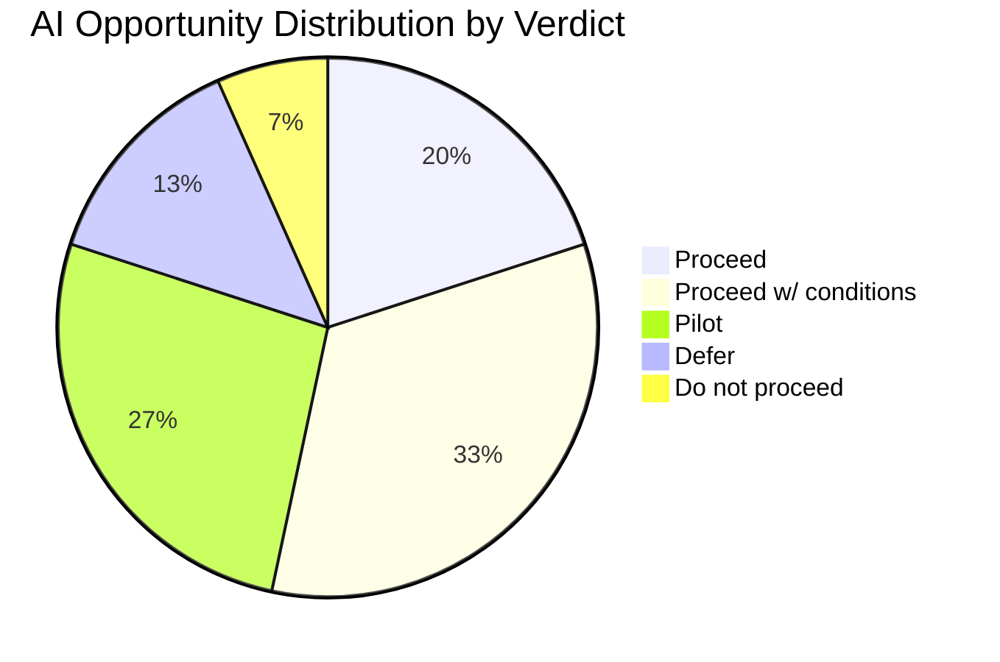
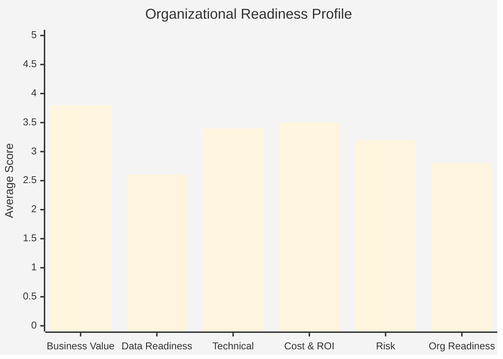

# AIG Heatmap — Readiness Visualization & Executive Reporting

This skill aggregates scored data from across the tracker and generates visual heatmaps, executive summaries, and prioritized roadmaps for leadership presentation.

## When to Use This Skill

- After scorecards have been generated by `aig-assess` and reviewed by the consultant
- When preparing for the executive readback session
- When the consultant needs a bird's-eye view of organizational AI readiness
- To identify patterns, clusters, and systemic blockers across the assessment

## Input Requirements

This skill reads from the `tracker/` directory:

- `tracker/company-profile.md` — organizational context
- `tracker/pillars/*/teams/*-team-card.md` — team readiness data
- `tracker/pillars/*/capabilities/*.md` — business capability data with AI potential indicators
- `tracker/pillars/*/ideas/*.md` — submitted AI use ideas
- `tracker/scorecards/*-scorecard.md` — scored opportunities
- `tracker/engagement-tracker.md` — engagement metadata

## Output Artifacts

### 1. AI Readiness Heatmap (`tracker/reports/ai-readiness-heatmap.md`)

Generate a comprehensive heatmap document containing:

#### Team Readiness Matrix

A Markdown table showing teams (rows) against readiness dimensions (columns):

```markdown
## Team Readiness Heatmap

| Team | AI Openness | Data Quality | Tech Readiness | Manual Task Load | Overall |
|---|:---:|:---:|:---:|:---:|:---:|
| Claims Processing | 🟢 4 | 🟡 2.5 | 🟡 3 | 🔴 High (120h/wk) | 🟡 Moderate |
| Policy Admin | 🟡 3 | 🟢 4 | 🟢 4 | 🟡 Med (40h/wk) | 🟢 Good |
| Customer Service | 🟢 5 | 🟡 3 | 🔴 2 | 🔴 High (80h/wk) | 🟡 Moderate |
```

Where scores are color-coded:
- 🟢 = 4–5 (strong / ready)
- 🟡 = 3 (moderate / gaps)
- 🔴 = 1–2 (weak / significant blockers)

**How to calculate each column:**
- **AI Openness:** Direct from `team-card.ai_openness.score`
- **Data Quality:** Average of `data_domains_owned[*].quality_self_assessment`
- **Tech Readiness:** Derived from tech stack modernity (cloud platforms, modern languages) vs. legacy indicators
- **Manual Task Load:** Sum of `top_manual_tasks[*].hours_per_week`
- **Overall:** Consultant's holistic judgment informed by all factors

#### Pillar-Level Aggregation

```markdown
## Pillar Summary

| Pillar | Teams Assessed | Capabilities Mapped | Ideas Submitted | Top Score | Avg Score |
|---|:---:|:---:|:---:|:---:|:---:|
| Insurance Operations | 5 | 12 | 8 | 4.12 | 3.45 |
| Technology & Data | 3 | 6 | 5 | 3.85 | 3.20 |
| Customer Experience | 4 | 8 | 6 | 3.60 | 2.90 |
```

#### Dimension-Level Organization View

```markdown
## Organizational Readiness by Dimension

| Dimension | Avg Score | Range | Key Observation |
|---|:---:|---|---|
| Business Value & Strategic Fit | 3.8 | 2.5–4.8 | Strong strategic alignment across the board |
| Data Readiness | 2.6 | 1.5–4.0 | Systemic weakness — data quality is the #1 blocker |
| Technical Feasibility | 3.4 | 2.0–4.5 | Mixed — modern teams score well, legacy teams struggle |
| Cost & ROI | 3.5 | 2.8–4.2 | Generally positive ROI cases |
| Risk Profile | 3.2 | 2.0–4.0 | Regulatory exposure requires attention |
| Org Readiness | 2.8 | 2.0–3.5 | Limited AI talent and governance gaps |
```

#### Mermaid Visualizations

Generate Mermaid diagrams for visual representation:

**AI Potential Bubble Chart (as a weighted pie):**


**Readiness Radar (as a bar chart approximation):**


#### Top Opportunities & Blockers

```markdown
## Top 5 AI Opportunities (by total score)

| Rank | Idea | Score | Verdict | Pillar | Quick Win? |
|:---:|---|:---:|---|---|:---:|
| 1 | Intelligent Claims Intake | 4.12 | Proceed w/ conditions | Insurance Ops | No |
| 2 | Email Classification | 3.95 | Proceed w/ conditions | Customer Exp | Yes ✅ |
| 3 | ... | ... | ... | ... | ... |

## Top 3 Organizational Blockers

1. **Data quality across the organization** — Average data quality score is 2.6/5. Multiple teams self-assess at 2 or below. *Recommendation: Invest in a data quality program before scaling AI.*
2. **Limited AI talent** — Only 3 data science staff. No ML engineers. *Recommendation: Hire or partner for initial implementations.*
3. **No AI governance framework** — Ethical charter in development but no formal policies. *Recommendation: Establish AI governance committee and adopt charter before production deployments.*
```

### 2. Executive Summary (`tracker/reports/executive-summary.md`)

Generate a narrative executive summary structured for the readback session:

```markdown
# Executive Summary — AI Readiness Assessment

**Client:** [Company Name]
**Assessment Period:** [dates]
**Consultant:** [name]

## Key Finding

[One paragraph — the single most important takeaway. Lead with the headline.]

## Readiness Profile

[2–3 paragraphs summarizing organizational readiness. Reference the dimension averages.
Highlight strengths (what the organization does well) before addressing gaps.
Frame gaps as opportunities, not failures.]

## Top Opportunities

[For each top 3–5 idea: one paragraph with the problem, proposed solution, expected value, and scorecard verdict. Include the total score.]

## Recommended Roadmap

### Wave 1: Quick Wins (Months 1–3)
[List quick-win ideas with scores and rationale]

### Wave 2: Strategic Pilots (Months 3–6)
[List pilot-worthy ideas with key de-risking actions]

### Wave 3: Scale & Expand (Months 6–12)
[List ideas to scale after successful pilots, plus next wave]

## Critical Prerequisites

[Numbered list of things that must happen regardless of which ideas are pursued — e.g., data quality program, AI governance framework, talent strategy]

## Investment Summary

| Item | Estimated Range | Timeline |
|---|---|---|
| Wave 1 initiatives | €[X]–€[Y] | Months 1–3 |
| Wave 2 pilots | €[X]–€[Y] | Months 3–6 |
| Enabling investments (data quality, governance, talent) | €[X]–€[Y] | Ongoing |
| **Total Year 1** | **€[X]–€[Y]** | |

## Next Steps

[3–5 specific, actionable next steps with suggested owners and timelines]
```

### 3. Capability AI Potential Map

Generate a view of business capabilities ranked by AI potential:

```markdown
## Business Capability AI Potential Map

| Capability | Team | AI Indicators | Maturity | Manual Hours/wk | AI Potential |
|---|---|:---:|:---:|:---:|---|
| Claims Intake | Claims Processing | 7/10 | 2 | 120 | 🔴 Critical opportunity |
| Document Classification | Claims Processing | 6/10 | 2 | 45 | 🔴 High opportunity |
| Invoice Processing | Finance | 5/10 | 3 | 30 | 🟡 Moderate opportunity |
```

**AI Potential classification:**
- 🔴 **Critical opportunity:** 6+ AI indicators true AND maturity ≤ 2 AND high manual hours
- 🟡 **Moderate opportunity:** 4–5 AI indicators true OR moderate manual hours
- 🟢 **Lower priority:** < 4 AI indicators true AND low manual hours

## Quality Notes

When generating reports, apply these quality standards:

- **Every claim must cite evidence.** "Data readiness is the biggest blocker" must reference specific teams and scores.
- **Use the organization's language.** Mirror terminology from the company profile (pillar names, strategic priority names).
- **Be honest but constructive.** "Low AI maturity" becomes "Early in the AI journey — positioned to learn from others' experience."
- **Quantify everything possible.** Hours saved, € value, error rates, not "significant improvement."
- **Make recommendations actionable.** "Improve data quality" is vague. "Conduct a data quality audit on Claims document archive (12TB, quality rating 2/5) within 4 weeks" is actionable.
