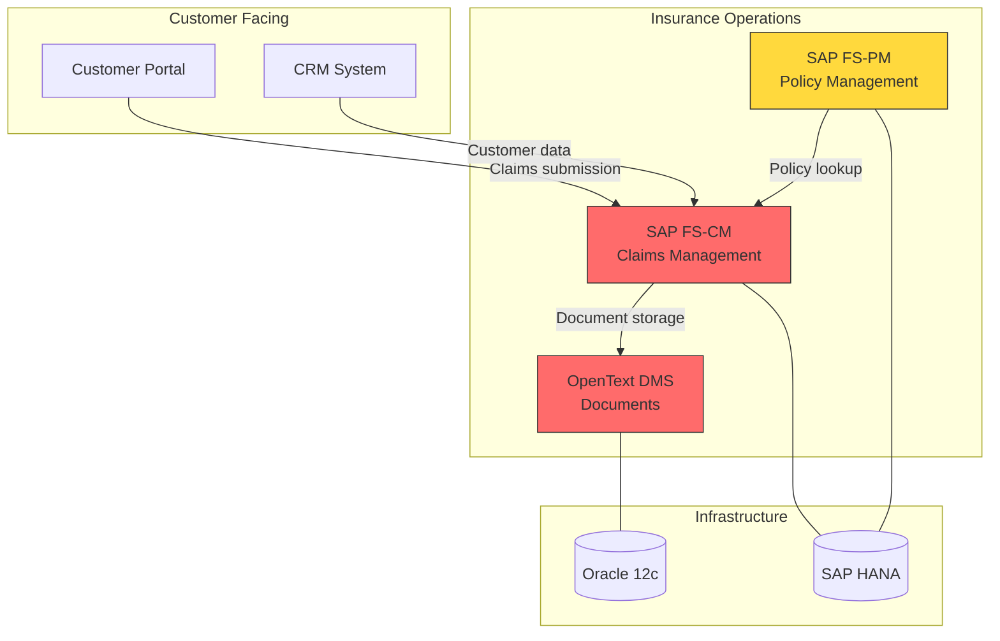
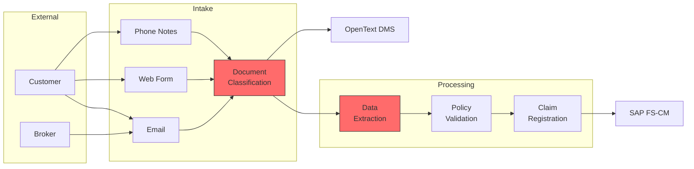

# AIG Matrix — Enterprise Architecture Cross-Reference Analysis

This skill reads business capability, team card, and company profile documents to generate TOGAF-inspired cross-reference matrices. It surfaces gaps in the architecture, identifies clusters of capabilities ripe for AI intervention, and visualizes the enterprise landscape.

## When to Use This Skill

- During the synthesis phase to understand the architectural landscape
- When identifying which applications, data domains, and technologies support which capabilities
- When looking for gaps (capabilities without application support, data without governance)
- When clustering related capabilities that could share an AI platform investment
- When preparing TOGAF deliverables for the executive presentation

## Input Requirements

Read from `tracker/`:

- `tracker/pillars/*/capabilities/*.md` — business capability documents (primary input)
- `tracker/pillars/*/teams/*-team-card.md` — team cards (for application and data context)
- `tracker/company-profile.md` — organizational context
- `tracker/scorecards/*.md` — scorecards (for enriching matrices with AI potential)

## Matrices to Generate

### Matrix 1: Business Capability → Application

Maps which applications support which business capabilities.

**How to build it:**
1. For each `business-capability.md`, read the `applications` list
2. For each `team-card.md`, read `applications_owned` and `applications_consumed`
3. Cross-reference to build the matrix

```markdown
## Business Capability × Application Matrix

| Capability | SAP FS-CM | SAP FS-PM | OpenText DMS | Excel | ABBYY | Portal |
|---|:---:|:---:|:---:|:---:|:---:|:---:|
| Claims Intake | ●P | ●S | ●S | | ●S | |
| Claims Assessment | ●P | ●S | ●S | ●S | | |
| Policy Admin | | ●P | ●S | | | ●S |
| Customer Onboarding | | ●S | | | | ●P |

**Legend:** ●P = Primary system, ●S = Supporting system
```

**Analysis to surface:**
- Applications that support many capabilities → critical systems (risk if they fail)
- Capabilities supported by only one application → single points of failure
- Shadow IT (Excel, personal tools) in critical processes → formalization opportunity
- Applications rated low on satisfaction across multiple teams → replacement candidates

### Matrix 2: Application → Data Domain

Maps which data domains flow through which applications.

**How to build it:**
1. For each capability, read `data_sources` and `data_outputs` (including which system they come from/go to)
2. For each team card, read `data_domains_owned`
3. Cross-reference applications to data domains

```markdown
## Application × Data Domain Matrix

| Application | Claims Records | Claims Documents | Policy Data | Customer Data | Financial Data |
|---|:---:|:---:|:---:|:---:|:---:|
| SAP FS-CM | ●O | R | R | R | W |
| SAP FS-PM | R | | ●O | R | |
| OpenText DMS | | ●O | | | |
| Excel ("tracking") | R | | | | R |

**Legend:** ●O = Owner/master, R = Reads, W = Writes
```

**Analysis to surface:**
- Data domains without a clear owner (no ●O) → governance gap
- Data accessed through Excel/shadow IT → data quality and audit risk
- Data domains with multiple writers → potential consistency issues
- Sensitive data (confidential/restricted) flowing through low-satisfaction systems → security concern

### Matrix 3: Data Domain → Technology

Maps the technology infrastructure supporting each data domain.

```markdown
## Data Domain × Technology Matrix

| Data Domain | Sensitivity | Format | Volume | Storage | Database | Cloud |
|---|---|---|---|---|---|---|
| Claims Records | Confidential | Structured | 3.2M records | SAP HANA | SAP HANA | On-premise |
| Claims Documents | Restricted | Unstructured | 12TB | OpenText | File store | On-premise |
| Policy Data | Confidential | Structured | 1.8M records | Oracle 12c | Oracle | On-premise |
| Customer Data | Confidential | Mixed | 2.5M records | SAP HANA | SAP HANA + CRM | On-premise |
```

**Analysis to surface:**
- All data on-premise → cloud migration may be prerequisite for some AI solutions
- Unstructured data volumes growing rapidly → document AI opportunity
- Legacy databases (Oracle 12c) → modernization pressure
- Sensitive data with limited access controls → AI processing constraints

### Matrix 4: AI Opportunity Cluster Map

This is the most actionable matrix. It identifies clusters of capabilities that share pain points and could benefit from shared AI investments.

**How to build it:**
1. Read all business capabilities with their `ai_potential_indicators`
2. Group capabilities by shared indicators and common applications/data
3. Identify clusters where a single AI investment could serve multiple capabilities

```markdown
## AI Opportunity Clusters

### Cluster 1: Document Intelligence
**Shared AI technique:** Intelligent Document Processing (IDP)
**Capabilities in cluster:**
- Claims Intake & Registration (7/10 AI indicators)
- Document Classification & Routing (6/10)
- Invoice Processing (5/10)

**Shared infrastructure:** Azure AI Document Intelligence + LLM post-processing
**Combined value:** ~€350K annual savings, ~200 hours/week recovered
**Rationale:** All three capabilities involve extracting structured data from unstructured documents. A shared IDP platform avoids building three separate solutions.

### Cluster 2: Predictive Analytics
**Shared AI technique:** ML classification/prediction
**Capabilities in cluster:**
- Fraud Detection (4/10 AI indicators, but pattern_recognition = true)
- Reserve Estimation (prediction_potential = true)
- Customer Churn Prediction (prediction_potential = true)

**Shared infrastructure:** ML platform + feature store
**Combined value:** Harder to quantify — risk reduction + pricing accuracy
**Rationale:** All three need historical data analysis and model training. A shared ML platform with a feature store serves all three.
```

## Gap Analysis

Generate a gap analysis identifying missing pieces in the architecture:

```markdown
## Gap Analysis

### Capabilities Without Application Support
| Capability | Current Status | Impact |
|---|---|---|
| [Capability] | Manual / Excel | No system of record; data trapped in spreadsheets |

### Data Domains Without Clear Ownership
| Data Domain | Used By | Issue |
|---|---|---|
| [Domain] | [Teams] | Multiple teams claim ownership; no single source of truth |

### Applications Without Modernization Path
| Application | Age | Satisfaction | Capabilities Supported | Risk |
|---|:---:|:---:|:---:|---|
| [App] | [years] | [1-5] | [count] | [what happens if it fails] |

### Missing Integration Points
| Source | Destination | Current | Issue |
|---|---|---|---|
| [System A] | [System B] | Manual re-entry | Data integrity risk, ~[X] hours/week wasted |
```

## Mermaid Diagram Generation

Generate architecture diagrams as Mermaid code for embedding in reports:

### Application Dependency Graph



Color-code by satisfaction: 🔴 red (1–2), 🟡 yellow (3), 🟢 green (4–5).

### Data Flow Diagram



Highlight manual/painful steps in red; automated steps in green.

## Output

Save all generated artifacts to `tracker/reports/`:

- `tracker/reports/architecture-matrices.md` — all 4 matrices with analysis
- `tracker/reports/gap-analysis.md` — gap analysis and missing pieces
- Update `tracker/reports/executive-summary.md` with architecture findings (if it exists)

## Connecting to the Assessment

The matrices provide the architectural context that enriches the scoring:

- **Cluster analysis** reveals where platform investments can serve multiple ideas — improving ROI scores
- **Gap analysis** identifies prerequisites that affect technical feasibility scores
- **Dependency mapping** informs risk profile scores (concentration risk, integration complexity)
- **Data governance gaps** explain low data readiness scores and suggest remediation

Suggest the consultant review scorecard dimensions that might change based on matrix findings.
