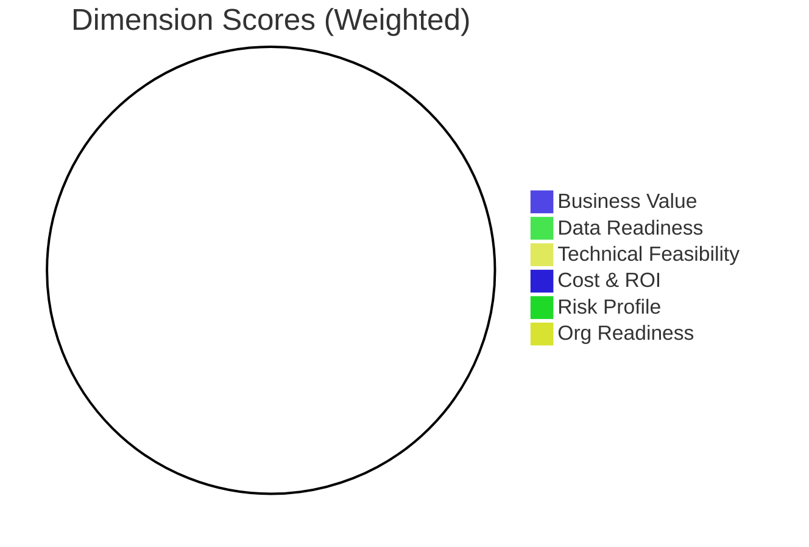

# AI Opportunity Scorecard: [Idea Name]

## Score Summary

| Dimension | Weight | Score | Weighted |
|---|:---:|:---:|:---:|
| 1. Business Value & Strategic Fit | 30% | _/5_ | _/1.50_ |
| 2. Data Readiness & Availability | 20% | _/5_ | _/1.00_ |
| 3. Technical Feasibility & Architecture Fit | 15% | _/5_ | _/0.75_ |
| 4. Cost, Effort & ROI | 15% | _/5_ | _/0.75_ |
| 5. Risk Profile | 10% | _/5_ | _/0.50_ |
| 6. Organisational & Change Readiness | 10% | _/5_ | _/0.50_ |
| **TOTAL** | **100%** | | **_/5.00_** |

### Verdict

| Score Range | Verdict | Action |
|:---:|---|---|
| 4.25 – 5.00 | ✅ **Proceed** | Strong case. Prioritise and move to solution design. |
| 3.50 – 4.24 | 🟢 **Proceed with conditions** | Good potential. Address identified gaps first. |
| 2.75 – 3.49 | 🟡 **Pilot / de-risk first** | Mixed picture. Run a focused proof of concept. |
| 2.00 – 2.74 | 🟠 **Defer** | Significant blockers. Create a remediation roadmap. |
| 1.00 – 1.99 | 🔴 **Do not proceed** | Fundamental blockers. Revisit in 12 months. |

**This idea's verdict:** [VERDICT]

## Radar Chart



## Key Strengths

_The 2–3 strongest arguments in favour of this initiative. Reference specific evidence from the scoring._

1. _Strength 1_
2. _Strength 2_
3. _Strength 3_

## Critical Risks & Blockers

_The key risks and blockers that would need to be resolved before or during implementation._

| Risk / Blocker | Severity | Dimension | Mitigation |
|---|:---:|:---:|---|
| _Description_ | _High / Medium / Low_ | _D1–D6_ | _How to address_ |

## Recommended Next Steps

_Specific, time-bound actions with suggested owners. These should flow directly from the verdict._

| # | Action | Owner | Timeline | Notes |
|---|---|---|---|---|
| 1 | _Action_ | _Role_ | _When_ | _Details_ |
| 2 | _Action_ | _Role_ | _When_ | _Details_ |

## Dependencies & Assumptions

_Key assumptions made during scoring. If any of these change, the score should be revisited._

- _Assumption 1_
- _Assumption 2_

## Comparison Notes

_If scoring multiple ideas, use this section to note how this idea compares to others. Which should be prioritised first? Are there dependencies between ideas?_

---

# Guidance

## How This Scorecard Is Generated

### Automated Scoring (via `aig-assess` skill)

1. The agent reads the `ai-use-idea.md` file and the `company-profile.md`
2. For each criterion, it maps the idea's data to the scoring guidance in `AI_Opportunity_Assessment_Framework.md`
3. It assigns a score (1–5) with an evidence statement explaining the reasoning
4. It calculates weighted subtotals and the total score
5. It flags criteria where confidence is low (e.g., "Data quality estimate is self-reported — recommend audit")
6. It saves the draft scorecard for consultant review

### Consultant Review

The agent's scores are **drafts**. The consultant must:

1. Review each dimension's scores and evidence
2. Adjust scores where consultant judgment differs from the agent's assessment
3. Add context the agent couldn't capture (e.g., political dynamics, unwritten constraints)
4. Write the narrative sections (Key Strengths, Risks, Next Steps)
5. Set the `scoring_method` to `agent_assisted`
6. Document any adjustments in `agent_metadata.consultant_adjustments`

### Scoring Scale Reference

| Score | Label | Meaning |
|:---:|---|---|
| **5** | Excellent | Strong evidence; minimal blockers |
| **4** | Good | Positive indicators with minor gaps |
| **3** | Moderate | Mixed picture; notable concerns offset by positives |
| **2** | Weak | Significant gaps or risks to address |
| **1** | Poor | Fundamental blockers present |

---

# Example

```yaml
---
schema: aig/scorecard/v1
idea_ref: "IDEA-001"
idea_name: "Intelligent Claims Intake"
assessment_date: "2026-04-18"
consultant: "Senior EA Consultant"
version: 1
scoring_method: "agent_assisted"

scores:
  business_value:
    weight: 0.30
    criteria:
      - name: "Magnitude of business impact"
        criterion_weight: 0.25
        score: 5
        evidence: "Quantified impact: 90 hours/week saved, €180K–€250K annual value. Error rate reduction from 8% to <2%. Directly measurable."
      - name: "Strategic alignment"
        criterion_weight: 0.15
        score: 5
        evidence: "Directly supports the #1 strategic priority (claims automation). Named by CEO in executive workshop."
      - name: "Scalability of value"
        criterion_weight: 0.10
        score: 5
        evidence: "AI extraction scales linearly — 2x claims volume at near-zero marginal cost. Critical for surge handling."
      - name: "Time-to-value"
        criterion_weight: 0.15
        score: 4
        evidence: "Estimated 3-month implementation (M-size effort). MVP for email claims could be live in 8 weeks."
      - name: "Competitive differentiation"
        criterion_weight: 0.10
        score: 3
        evidence: "IDP is increasingly common in insurance. This is table-stakes modernization rather than a differentiator."
    subtotal: 1.37

  data_readiness:
    weight: 0.20
    criteria:
      - name: "Data existence & accessibility"
        criterion_weight: 0.30
        score: 4
        evidence: "3.2M historical claims records exist in SAP. 12TB documents in OpenText. Both accessible via APIs, though OpenText API is unreliable."
      - name: "Data volume & representativeness"
        criterion_weight: 0.25
        score: 4
        evidence: "Large corpus covering all claim types. 500 labelled examples need to be created for validation, but this is feasible."
      - name: "Data quality"
        criterion_weight: 0.25
        score: 2
        evidence: "Document scan quality is highly variable. Older documents lack OCR. Team self-assessed document quality at 2/5. Recommend a data quality audit before full commitment."
      - name: "Data governance & ownership"
        criterion_weight: 0.20
        score: 3
        evidence: "Claims team has clear data ownership. GDPR DPO is engaged. However, no formal AI-specific data governance policy exists yet."
    subtotal: 0.66

  technical_feasibility:
    weight: 0.15
    criteria:
      - name: "Solution maturity (AI technology readiness)"
        criterion_weight: 0.20
        score: 5
        evidence: "IDP with Azure AI Document Intelligence is commodity technology with hundreds of reference implementations in insurance."
      - name: "Integration complexity"
        criterion_weight: 0.20
        score: 3
        evidence: "SAP FS-CM integration is complex (custom ABAP/API work required). OpenText integration is fragile. Email integration is straightforward."
      - name: "Build vs buy decision clarity"
        criterion_weight: 0.15
        score: 4
        evidence: "Clear decision: use Azure AI Document Intelligence APIs (already in tenant) + LLM post-processing. No custom model training needed."
      - name: "Infrastructure & MLOps readiness"
        criterion_weight: 0.25
        score: 3
        evidence: "Azure tenant exists. No MLOps pipeline or model monitoring capability. Will need to build monitoring for extraction accuracy."
      - name: "Vendor / technology lock-in risk"
        criterion_weight: 0.20
        score: 3
        evidence: "Azure dependency, but extraction APIs are somewhat portable (AWS Textract, Google Document AI are alternatives). LLM layer can be model-agnostic."
    subtotal: 0.53

  cost_and_roi:
    weight: 0.15
    criteria:
      - name: "Implementation cost (CAPEX)"
        criterion_weight: 0.25
        score: 4
        evidence: "€80K–€120K is proportionate to the expected €180K–€250K annual value. Well within the stated €300K–€800K budget."
      - name: "Ongoing operational cost (OPEX)"
        criterion_weight: 0.20
        score: 4
        evidence: "€15K–€25K/year API costs are predictable and low relative to value. Volume-based pricing is transparent."
      - name: "Estimated ROI & payback period"
        criterion_weight: 0.35
        score: 4
        evidence: "Payback period <12 months. Conservative ROI estimate of 150–200%. Strong financial case."
      - name: "Organisational effort (change burden)"
        criterion_weight: 0.20
        score: 4
        evidence: "Change is contained to one team (34 people). Role evolution from data entry to review is a positive career development story."
    subtotal: 0.60

  risk_profile:
    weight: 0.10
    criteria:
      - name: "Regulatory & compliance risk"
        criterion_weight: 0.25
        score: 3
        evidence: "Document extraction itself is not high-risk under AI Act. However, outputs feed claims decisions — need to ensure human review gate satisfies regulatory requirements."
      - name: "AI output quality risk (hallucination / error)"
        criterion_weight: 0.30
        score: 4
        evidence: "Extraction errors are detectable (structured fields can be validated) and reversible. Human review gate catches errors before they enter SAP."
      - name: "Data privacy & security risk"
        criterion_weight: 0.20
        score: 3
        evidence: "PII and health data are processed. Azure AI services can run within the tenant (data stays in region). DPO needs to approve the data processing agreement."
      - name: "Adoption & change resistance risk"
        criterion_weight: 0.15
        score: 4
        evidence: "Team enthusiasm is 4/5. Team lead is the champion. Prior OCR pilot experience means team is not starting from zero."
      - name: "Dependency & concentration risk"
        criterion_weight: 0.10
        score: 3
        evidence: "Azure dependency exists but alternatives are available. No single-point-of-failure if Azure Document Intelligence has an outage — manual fallback is the current process."
    subtotal: 0.35

  org_readiness:
    weight: 0.10
    criteria:
      - name: "Executive sponsorship"
        criterion_weight: 0.30
        score: 5
        evidence: "VP Insurance Operations (Thomas Brenner) is named sponsor with explicit budget authority and personal commitment."
      - name: "Internal AI capability & talent"
        criterion_weight: 0.25
        score: 2
        evidence: "Only 3 data science staff in the entire organization. No ML engineer. Will need external support for implementation. Consultant flagged: this is the weakest dimension."
      - name: "Digital & data culture maturity"
        criterion_weight: 0.20
        score: 3
        evidence: "Mixed track record. Cloud migration was successful. Chatbot project failed. Team-level enthusiasm is high but organization-wide culture is cautious."
      - name: "AI governance framework"
        criterion_weight: 0.25
        score: 2
        evidence: "No formal AI governance framework exists. Ethical AI charter is being developed as part of this engagement. Needed before production deployment."
    subtotal: 0.30

total_score: 3.81
verdict: "proceed_with_conditions"
confidence_level: "medium"
confidence_notes: "Data quality (Dimension 2) is the key uncertainty. Recommend a focused data quality audit on claims documents before committing to full budget. Also recommend establishing AI governance framework before production deployment."

agent_metadata:
  scored_by_agent: true
  agent_score: 3.75
  consultant_adjustments: ["Increased business_value.strategic_alignment from 4 to 5 (CEO explicitly named this in workshop)", "Decreased org_readiness.talent from 3 to 2 (agent overestimated internal capability)"]
  low_confidence_flags: ["data_readiness.data_quality — self-reported, no audit", "org_readiness.governance — framework in development, not yet established"]
---
```
