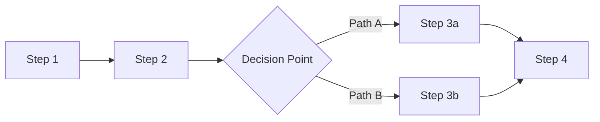
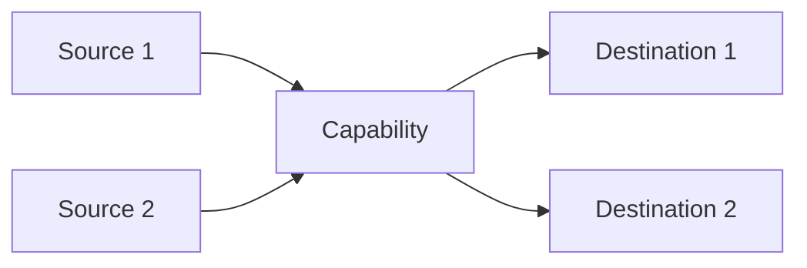

# Business Capability: [Capability Name]

## Capability Description

_A clear, non-technical description of what this capability does, why it exists, and what business outcome it delivers. Write this so that a C-level executive could understand it._

## Current Process ("As-Is")

_Walk through the current process step by step. For each step, note who does it (human or system), approximately how long it takes, and where the friction is. Use the `process_steps` YAML field for structured data; use this section for the narrative._

### Process Flow Diagram



## Data Flow

_Describe how data enters this capability, how it is transformed or enriched, and where it goes. Reference the `data_sources` and `data_outputs` in the YAML._

### Data Flow Diagram



## Integration Dependencies

_Which systems does this capability connect to? What is the nature of each integration (API, file transfer, manual)? Where are the fragile points?_

## Observations & AI Opportunity Notes

_The consultant's analysis of where AI could improve this capability. This section connects the pain points and AI potential indicators to specific, actionable AI use cases. Be concrete: "Document classification AI could eliminate 45 hours/week of manual sorting" not "AI could help."_

### Highest-Potential AI Interventions

1. _Intervention 1: specific, actionable, tied to a pain point and potential indicator_
2. _Intervention 2_
3. _Intervention 3_

### Readiness Assessment

_How ready is this capability for AI intervention? Consider data availability, integration complexity, team willingness, and regulatory constraints._

---

# Guidance

## How to Fill This Template

This template is filled **collaboratively** by the **Department Head and Consultant** during or after the **Department Discovery Session**. One capability document is created per significant business capability identified.

### What Is a "Business Capability"?

A business capability is **what** the business does, independent of **how** it does it. It represents a stable function that the organization must perform.

**Good capability names:**
- "Claims Intake & Registration"
- "Invoice Processing"
- "Employee Onboarding"
- "Customer Identity Verification"

**Too broad:**
- "Claims" (this is a domain, not a capability — break it down)
- "Operations" (too vague to assess)

**Too narrow:**
- "Entering data into field 7 of the SAP form" (this is a task, not a capability)

### The EA Framework Mapping Fields

| Field | Purpose | How to fill it |
|---|---|---|
| `togaf_layer` | Maps to TOGAF Architecture Domain | **Business** = business processes and org structure. **Application** = software systems. **Data** = information assets. **Technology** = infrastructure and platforms. |
| `togaf_phase` | Maps to TOGAF ADM Phase | Phase B for business capabilities, Phase C for application/data capabilities, Phase D for technology capabilities |
| `zachman_row` | Maps to Zachman Framework row | Most capabilities map to **Conceptual** (business model) or **Logical** (system model). Use **Contextual** for enterprise-wide capabilities. |
| `zachman_column` | Maps to Zachman Framework column | **How** (Function) for process capabilities, **What** (Data) for data management capabilities, **Who** (People) for organizational capabilities |
| `maturity_level` | CMMI-inspired maturity | 1=Ad-hoc/chaotic, 2=Repeatable but reactive, 3=Defined and documented, 4=Measured and controlled, 5=Continuously optimizing |

### The AI Potential Indicators

These boolean flags are the **primary input for the `aig-assess` agent skill**. Set them honestly based on what you observed:

| Indicator | Set to `true` when... |
|---|---|
| `repetitive` | The same steps are performed over and over on different inputs (e.g., processing each invoice the same way) |
| `data_rich` | Large volumes of structured or semi-structured data exist and are accessible |
| `error_prone` | Human errors happen regularly and have measurable consequences (rework, customer complaints, financial loss) |
| `high_volume` | Hundreds or thousands of transactions/documents are processed per week |
| `rule_based` | Decisions follow documented rules, decision trees, or lookup tables |
| `pattern_recognition` | The work involves spotting patterns (fraud, anomalies, trends) in data |
| `language_heavy` | Significant time is spent reading, writing, summarizing, or translating text |
| `search_intensive` | Staff spend time hunting for information across multiple systems or document stores |
| `prediction_potential` | Outcomes (e.g., claim cost, customer churn) could potentially be predicted from historical data |
| `classification_needed` | Items need to be categorized, sorted, or routed to the right destination |

**Rule of thumb:** If 4+ indicators are `true`, this capability has strong AI potential. If 6+, it's a top-priority candidate.

---

# Example

```yaml
---
schema: aig/business-capability/v1
capability_name: "Claims Intake & Registration"
capability_id: "INS-CLM-001"
owning_team: "Claims Processing"
pillar: "Insurance Operations"
entity: "Nordvik Insurance SE"

togaf_layer: "Business"
togaf_phase: "Phase B (Business)"
zachman_row: "Conceptual (Business Model)"
zachman_column: "How (Function)"

as_is_status: "semi-automated"
maturity_level: 2
description: "Receives first notification of loss (FNOL) from customers, brokers, and agents through multiple channels (phone, email, web form, postal mail), validates policy coverage, registers the claim in the core system, and initiates the claims handling workflow."

volume_metrics:
  transactions_per_day: 80
  documents_per_week: 1200
  decisions_per_week: 400
  records_managed: 3200000
  custom_metric:
    name: "Channels processed"
    value: "4"
    unit: "channels (phone, email, web, post)"
performance_metrics:
  average_cycle_time: "45 minutes per claim registration"
  target_cycle_time: "15 minutes per claim registration"
  error_rate: "~8% data entry errors requiring rework"
  customer_impact: "direct"
  sla_compliance: "82% acknowledged within 24 hours (target: 95%)"

data_sources:
  - name: "Customer claim submissions"
    type: "email"
    system: "Outlook / shared mailbox"
    quality: 2
    refresh_frequency: "real_time"
    notes: "Unstructured — claims arrive as free-text emails with attachments in varying formats"
  - name: "Web form submissions"
    type: "web_form"
    system: "Nordvik customer portal"
    quality: 4
    refresh_frequency: "real_time"
    notes: "Structured but only 30% of claims come through this channel"
  - name: "Phone FNOL notes"
    type: "manual"
    system: "Call centre notes in CRM"
    quality: 2
    refresh_frequency: "real_time"
    notes: "Free-text notes typed during calls. Quality depends on the agent."
  - name: "Policy master data"
    type: "API"
    system: "SAP FS-PM"
    quality: 4
    refresh_frequency: "real_time"
    notes: "Reliable but API response times are slow (2–4 seconds per lookup)"
data_outputs:
  - name: "Registered claim record"
    destination: "SAP FS-CM (Claims Management)"
    format: "structured"
  - name: "Claim acknowledgement"
    destination: "Customer (email/letter)"
    format: "document"
  - name: "Task assignment"
    destination: "Claims handler queue"
    format: "notification"

applications:
  - name: "SAP FS-CM"
    role: "primary"
    satisfaction: 2
    modernization_status: "current"
  - name: "SAP FS-PM"
    role: "supporting"
    satisfaction: 3
    modernization_status: "current"
  - name: "OpenText DMS"
    role: "supporting"
    satisfaction: 2
    modernization_status: "end_of_life"
  - name: "ABBYY FineReader"
    role: "supporting"
    satisfaction: 3
    modernization_status: "current"

integration_points:
  - system: "SAP FS-PM"
    direction: "inbound"
    type: "REST_API"
    reliability: "reliable"
    notes: "Used for policy validation. Slow but stable."
  - system: "OpenText DMS"
    direction: "outbound"
    type: "SOAP"
    reliability: "intermittent"
    notes: "Document upload fails during peak hours. Retry logic is manual."
  - system: "Email server"
    direction: "inbound"
    type: "email"
    reliability: "reliable"
    notes: "Claims emails are manually forwarded from shared mailbox to individual handlers."

process_steps:
  - step: "Receive FNOL"
    description: "Claim notification arrives via email, phone, web form, or post"
    actor: "human"
    time_estimate: "2 min (web form) to 15 min (phone call)"
    pain_level: 1
  - step: "Classify claim type"
    description: "Determine claim category (property, motor, liability, etc.) and line of business"
    actor: "human"
    time_estimate: "3 min"
    pain_level: 1
  - step: "Validate policy coverage"
    description: "Look up the policy in SAP FS-PM, verify coverage is active and claim type is covered"
    actor: "human_and_system"
    time_estimate: "5 min"
    pain_level: 2
  - step: "Extract claim data from documents"
    description: "Read the claim form, supporting documents, and correspondence to extract key data fields (date of loss, description, amount, parties involved)"
    actor: "human"
    time_estimate: "15 min"
    pain_level: 3
  - step: "Enter claim into SAP FS-CM"
    description: "Manually key all extracted data into SAP fields in the required sequence"
    actor: "human"
    time_estimate: "12 min"
    pain_level: 3
  - step: "Upload documents to DMS"
    description: "Scan paper documents (if any), classify all documents, and upload to OpenText"
    actor: "human"
    time_estimate: "8 min"
    pain_level: 2
  - step: "Send acknowledgement"
    description: "Generate and send claim acknowledgement letter/email to the customer"
    actor: "human_and_system"
    time_estimate: "3 min"
    pain_level: 0

pain_points:
  - description: "Manual data extraction from unstructured documents (emails, scanned forms) takes 15 min per claim and has an 8% error rate"
    impact: "time_waste"
    severity: "critical"
  - description: "SAP data entry requires fields to be filled in a specific sequence that doesn't match the order information appears in documents"
    impact: "time_waste"
    severity: "high"
  - description: "OpenText document upload fails during peak hours, requiring manual retries"
    impact: "error_prone"
    severity: "medium"
  - description: "SLA compliance is at 82% vs. 95% target — primarily due to email backlog during peak periods"
    impact: "customer_impact"
    severity: "high"

ai_potential_indicators:
  repetitive: true
  data_rich: true
  error_prone: true
  high_volume: true
  rule_based: true
  pattern_recognition: false
  language_heavy: true
  search_intensive: false
  classification_needed: true
  prediction_potential: false

dependencies:
  upstream_capabilities: ["Customer Communication", "Broker Submission Management"]
  downstream_capabilities: ["Claims Assessment & Adjustment", "Claims Payment Processing", "Fraud Detection"]
  critical_dependencies: ["SAP FS-PM must be available for policy validation"]

assessment_date: "2026-04-16"
assessed_by: "Senior EA Consultant"
---
```

## Observations & AI Opportunity Notes (Example)

Claims Intake scores **7 out of 10** AI potential indicators — one of the highest-potential capabilities identified in this assessment. The combination of high volume (80 claims/day), heavy document processing, significant manual data entry, and measurable error rates creates an ideal environment for AI intervention.

### Highest-Potential AI Interventions

1. **Intelligent Document Extraction (IDP):** Replace manual data extraction from claim forms, emails, and supporting documents with an AI-powered Intelligent Document Processing pipeline (e.g., Azure AI Document Intelligence or AWS Textract + LLM). This directly addresses the 15 min/claim bottleneck and the 8% error rate. Estimated impact: **~60 hours/week recovered, error rate reduced to <2%**.

2. **Automated Claim Classification & Routing:** Use an LLM classifier to read incoming claims and automatically categorize them by type, line of business, and complexity — then route to the appropriate handler or fast-track queue. Currently takes 3 min/claim manually. At 400 claims/week, this saves **~20 hours/week** and improves SLA compliance.

3. **Email-to-Structured-Data Conversion:** 70% of claims arrive as unstructured emails. An LLM pipeline could parse these emails, extract key fields (date of loss, policy number, description, claimed amount), and pre-populate the SAP FS-CM registration form. The human reviewer then validates rather than types from scratch.

### Readiness Assessment

- **Data availability:** ✅ Strong — 3.2M historical claims records and 12TB of documents provide ample training/reference data
- **Integration complexity:** ⚠️ Moderate — SAP FS-CM integration will require custom middleware; OpenText API is fragile
- **Team willingness:** ✅ Strong — team scores 4/5 on AI openness and has prior OCR pilot experience
- **Regulatory constraint:** ⚠️ Moderate — medical documents are restricted; any AI processing must comply with GDPR and health data regulations. Human-in-the-loop is mandatory for this data type.
