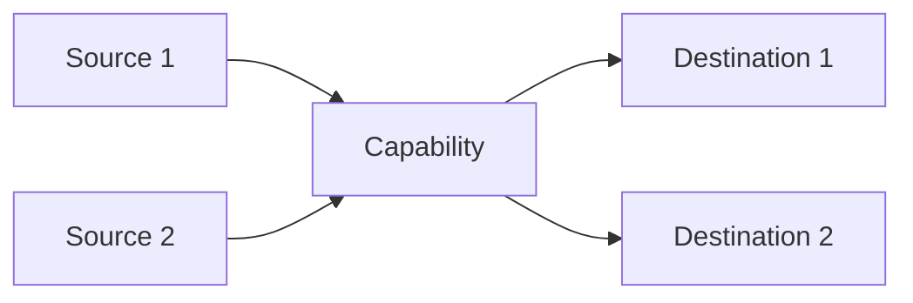

# Business Capability: [Capability Name]

## Capability Description

_A clear, non-technical description of **what** this capability does, why it exists, and what business outcome it delivers. Write this so that a C-level executive could understand it. Focus on the outcome, not the steps — the "what", not the "how"._


## Data Flow

_Describe how data enters this capability, how it is transformed or enriched, and where it goes. Reference the `data_sources` and `data_outputs` in the YAML._

### Data Flow Diagram



## Integration Dependencies

_Which systems does this capability connect to? What is the nature of each integration (API, file transfer, manual)? Where are the fragile points?_


# Guidance

## How to Fill This Template

This template is filled **collaboratively** by the **Department Head and Consultant** during or after the **Department Discovery Session**. One capability document is created per significant business capability identified.


### What Is a "Business Capability"?

A business capability is **what** the business does, independent of **how** it does it. It represents a stable function that the organization must perform.

**Good capability names:**
- "Claims Intake & Registration"
- "Invoice Processing"
- "Employee Onboarding"
- "Customer Identity Verification"

**Too broad:**
- "Claims" (this is a domain, not a capability — break it down)
- "Operations" (too vague to assess)

**Too narrow:**
- "Entering data into field 7 of the SAP form" (this is a task, not a capability)

### Capability Levels

| Level | What it means | Example |
|:---:|---|---|
| **L1** | Domain / area | "Claims Management" |
| **L2** | Capability | "Claims Intake & Registration" |
| **L3** | Sub-capability | "Claims Document Classification" |

> **Rule of thumb (per LeanIX):** Keep capability hierarchies to **max 2–3 levels**. If you find yourself going deeper, you're probably describing process steps, not capabilities.

### The EA Framework Mapping Fields

| Field | Purpose | How to fill it |
|---|---|---|
| `togaf_layer` | Maps to TOGAF Architecture Domain | **Business** = business processes and org structure. **Application** = software systems. **Data** = information assets. **Technology** = infrastructure and platforms. |
| `togaf_phase` | Maps to TOGAF ADM Phase | Phase B for business capabilities, Phase C for application/data capabilities, Phase D for technology capabilities |
| `zachman_row` | Maps to Zachman Framework row | Most capabilities map to **Conceptual** (business model) or **Logical** (system model). Use **Contextual** for enterprise-wide capabilities. |
| `zachman_column` | Maps to Zachman Framework column | **How** (Function) for process capabilities, **What** (Data) for data management capabilities, **Who** (People) for organizational capabilities |
| `maturity_level` | CMMI-inspired maturity | 1=Ad-hoc/chaotic, 2=Repeatable but reactive, 3=Defined and documented, 4=Measured and controlled, 5=Continuously optimizing |


---

# Example

```yaml
---
schema: aig/business-capability/v2
capability_name: "Claims Intake & Registration"
capability_id: "INS-CLM-001"
capability_level: "L2"
owning_team: "Claims Processing"
pillar: "Insurance Operations"
entity: "Nordvik Insurance SE"

togaf_layer: "Business"
togaf_phase: "Phase B (Business)"
zachman_row: "Conceptual (Business Model)"
zachman_column: "How (Function)"

as_is_status: "semi-automated"
maturity_level: 2
description: "Receives first notification of loss (FNOL) from customers, brokers, and agents through multiple channels (phone, email, web form, postal mail), validates policy coverage, registers the claim in the core system, and initiates the claims handling workflow."

volume_metrics:
  transactions_per_day: 80
  documents_per_week: 1200
  decisions_per_week: 400
  records_managed: 3200000
  custom_metric:
    name: "Channels processed"
    value: "4"
    unit: "channels (phone, email, web, post)"
performance_metrics:
  average_cycle_time: "45 minutes per claim registration"
  target_cycle_time: "15 minutes per claim registration"
  error_rate: "~8% data entry errors requiring rework"
  customer_impact: "direct"
  sla_compliance: "82% acknowledged within 24 hours (target: 95%)"

data_sources:
  - name: "Customer claim submissions"
    type: "email"
    system: "Outlook / shared mailbox"
    quality: 2
    refresh_frequency: "real_time"
    notes: "Unstructured — claims arrive as free-text emails with attachments in varying formats"
  - name: "Web form submissions"
    type: "web_form"
    system: "Nordvik customer portal"
    quality: 4
    refresh_frequency: "real_time"
    notes: "Structured but only 30% of claims come through this channel"
  - name: "Phone FNOL notes"
    type: "manual"
    system: "Call centre notes in CRM"
    quality: 2
    refresh_frequency: "real_time"
    notes: "Free-text notes typed during calls. Quality depends on the agent."
  - name: "Policy master data"
    type: "API"
    system: "SAP FS-PM"
    quality: 4
    refresh_frequency: "real_time"
    notes: "Reliable but API response times are slow (2–4 seconds per lookup)"
data_outputs:
  - name: "Registered claim record"
    destination: "SAP FS-CM (Claims Management)"
    format: "structured"
  - name: "Claim acknowledgement"
    destination: "Customer (email/letter)"
    format: "document"
  - name: "Task assignment"
    destination: "Claims handler queue"
    format: "notification"

applications:
  - name: "SAP FS-CM"
    role: "primary"
    satisfaction: 2
    modernization_status: "current"
  - name: "SAP FS-PM"
    role: "supporting"
    satisfaction: 3
    modernization_status: "current"
  - name: "OpenText DMS"
    role: "supporting"
    satisfaction: 2
    modernization_status: "end_of_life"
  - name: "ABBYY FineReader"
    role: "supporting"
    satisfaction: 3
    modernization_status: "current"

integration_points:
  - system: "SAP FS-PM"
    direction: "inbound"
    type: "REST_API"
    reliability: "reliable"
    notes: "Used for policy validation. Slow but stable."
  - system: "OpenText DMS"
    direction: "outbound"
    type: "SOAP"
    reliability: "intermittent"
    notes: "Document upload fails during peak hours. Retry logic is manual."
  - system: "Email server"
    direction: "inbound"
    type: "email"
    reliability: "reliable"
    notes: "Claims emails are manually forwarded from shared mailbox to individual handlers."


dependencies:
  upstream_capabilities: ["Customer Communication", "Broker Submission Management"]
  downstream_capabilities: ["Claims Assessment & Adjustment", "Claims Payment Processing", "Fraud Detection"]
  critical_dependencies: ["SAP FS-PM must be available for policy validation"]

assessment_date: "2026-04-16"
assessed_by: "Senior EA Consultant"
---
```


