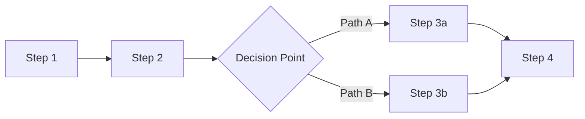

# Business Process: [Process Name]

## Process Description

_A clear description of how this process operates today, what triggers it, and what the ultimate output is. Differentiate between local processes (owned by one team) and end-to-end processes (spanning multiple teams)._

## Process Flow Diagram



## Observations & AI Opportunity Notes

_The consultant's analysis of where AI could improve this process. This section connects the pain points and AI potential indicators to specific, actionable AI use cases. Be concrete: "Document classification AI could eliminate 45 hours/week of manual sorting at step 3" not "AI could help."_

### Highest-Potential AI Interventions

1. _Intervention 1: specific, actionable, tied to a pain point and potential indicator_
2. _Intervention 2_
3. _Intervention 3_

### Readiness Assessment

_How ready is this process for AI intervention? Consider data availability, integration complexity, team willingness, and regulatory constraints._

---

# Guidance

## How to Fill This Template

This is the **core artifact for AI Discovery**. While capabilities define "what" the business does, the **process** defines "how" — and "how" is where AI creates value by reducing friction, saving time, and improving quality.

### Local vs. End-to-End Processes

| Type | Definition | Example |
|---|---|---|
| **Local** | Executed entirely or primarily by one team. | "Invoice Data Entry" |
| **End-to-End** | Cross-team value stream. | "Procure-to-Pay", "Order-to-Cash" |

If a team describes their contribution to an end-to-end process, set `process_type: "end_to_end"` and map all the capabilities it touches in `supported_capabilities`.

### The AI Potential Indicators

These boolean flags are the **primary input for the `aig-assess` agent skill**. Set them honestly based on what you observed during the interview:

| Indicator | Set to `true` when... |
|---|---|
| `repetitive` | The same steps are performed over and over on different inputs |
| `data_rich` | Large volumes of structured or semi-structured data exist and are accessible |
| `error_prone` | Human errors happen regularly and have measurable consequences |
| `high_volume` | Hundreds or thousands of transactions/documents are processed per week |
| `rule_based` | Decisions follow documented rules, decision trees, or lookup tables |
| `pattern_recognition` | The work involves spotting patterns (fraud, anomalies, trends) in data |
| `language_heavy` | Significant time is spent reading, writing, summarizing, or translating text |
| `search_intensive` | Staff spend time hunting for information across multiple systems |
| `prediction_potential` | Outcomes could potentially be predicted from historical data |
| `classification_needed` | Items need to be categorized, sorted, or routed |

**Rule of thumb:** If 4+ indicators are `true`, this process has strong AI potential.

---

# Example

```yaml
---
schema: aig/business-process/v1
process_name: "FNOL Intake & Registration"
process_id: "PROC-CLM-001"
process_type: "local"
owning_team: "Claims Processing"
supported_capabilities: ["INS-CLM-001"]

as_is_status: "semi-automated"
volume: "~400 claims/week"
sla: "Acknowledge within 24 hours"

steps:
  - step: "Receive FNOL"
    description: "Claim notification arrives via email, phone, web form, or post"
    actor: "human"
    time_estimate: "2 min (web form) to 15 min (phone call)"
    pain_level: 1
  - step: "Classify claim type"
    description: "Determine claim category and line of business"
    actor: "human"
    time_estimate: "3 min"
    pain_level: 1
  - step: "Validate policy coverage"
    description: "Look up the policy in SAP FS-PM, verify coverage is active"
    actor: "human_and_system"
    time_estimate: "5 min"
    pain_level: 2
  - step: "Extract claim data from documents"
    description: "Read the claim form, supporting documents, to extract key data fields"
    actor: "human"
    time_estimate: "15 min"
    pain_level: 3
  - step: "Enter claim into SAP FS-CM"
    description: "Manually key all extracted data into SAP fields"
    actor: "human"
    time_estimate: "12 min"
    pain_level: 3
  - step: "Upload documents to DMS"
    description: "Scan paper documents, classify, and upload to OpenText"
    actor: "human"
    time_estimate: "8 min"
    pain_level: 2
  - step: "Send acknowledgement"
    description: "Generate and send claim acknowledgement letter/email to the customer"
    actor: "human_and_system"
    time_estimate: "3 min"
    pain_level: 0

pain_points:
  - description: "Manual data extraction from unstructured documents takes 15 min per claim"
    impact: "time_waste"
    severity: "critical"
  - description: "SAP data entry requires fields to be filled in a specific sequence"
    impact: "time_waste"
    severity: "high"

ai_potential_indicators:
  repetitive: true
  data_rich: true
  error_prone: true
  high_volume: true
  rule_based: true
  pattern_recognition: false
  language_heavy: true
  search_intensive: false
  classification_needed: true
  prediction_potential: false

assessment_date: "2026-04-16"
assessed_by: "Senior EA Consultant"
---
```
