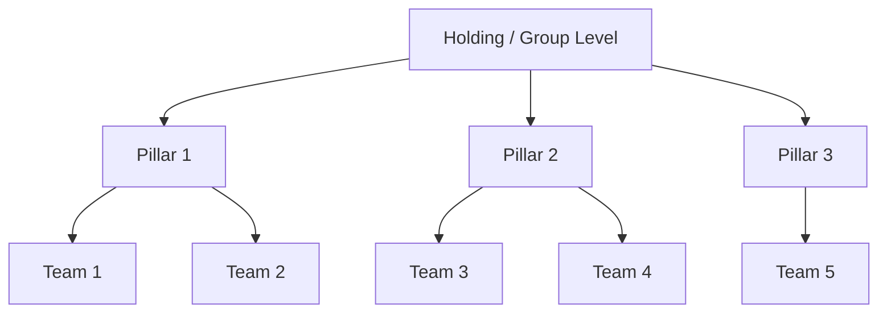

# Company Profile: [Company Name]

## Executive Summary

_A 2–3 paragraph overview of the organization's current state, strategic direction, and the context for this AI assessment. Written after the executive workshop._

## Strategic Context

### Business Environment

_What market pressures, competitive dynamics, or industry trends are driving the need for AI adoption? What external forces (regulation, customer expectations, cost pressure) are relevant?_

### Current Digital Maturity

_Where does this organization sit on the digital transformation journey? Have they successfully adopted cloud, automation, or analytics? What has worked and what has struggled?_

## Organizational Structure

_Describe the organizational hierarchy relevant to the assessment. Which pillars/divisions are in scope? How autonomous are they? Where does decision-making authority sit for technology investments?_



## Current AI Landscape

_What AI or ML initiatives already exist? What has been tried? What worked, what failed, and why? Are there shadow AI projects (teams using ChatGPT informally)?_

## Key Constraints & Concerns

_What are the executive team's primary concerns about AI adoption? Common themes: data privacy, regulatory risk, job displacement fears, skills gap, vendor lock-in, cost uncertainty._

## Stakeholder Map

| Stakeholder | Role | Attitude toward AI | Influence Level | Notes |
|---|---|---|:---:|---|
| _Name_ | _Title_ | _Champion / Supportive / Neutral / Skeptical / Resistant_ | _High / Medium / Low_ | _Key observations_ |

---

# Guidance

## How to Fill This Template

This template should be completed by the **consultant** during or immediately after the **Executive Workshop** (see `docs/guidelines/02-executive-workshop.md`).

### YAML Frontmatter Fields

| Field | How to fill it |
|---|---|
| `company_name` | Legal name of the parent organization being assessed |
| `industry` | Primary industry classification — use the closest match from the enum |
| `employee_count` | Approximate total headcount. Ask for "rough order of magnitude" if exact numbers are sensitive |
| `revenue_range` | Revenue band, not exact figure. Executives are more comfortable sharing ranges |
| `legal_entities` | List all legal entities in scope. For each, note its country, headcount, and primary function |
| `organizational_pillars` | The major business divisions. These become the directory structure in `tracker/pillars/` |
| `strategic_priorities` | The top 3–5 priorities as articulated by the executive team. Rank by importance. Use their language, not yours |
| `ai_maturity.score` | Your consultant assessment of their AI maturity (1–5). Base this on evidence, not their self-assessment |
| `ai_maturity.justification` | 2–3 sentences explaining the score. Reference specific evidence |
| `ai_maturity.existing_ai_initiatives` | List any current or past AI projects. Include failures — they reveal organizational readiness |
| `regulatory_exposure` | Assess which regulations apply. For AI Act, determine the risk classification of their likely AI use cases |
| `budget_range` | What the executive team has indicated they could invest in AI initiatives. Use ranges |
| `risk_appetite` | Based on how they responded to risk-related questions in the workshop |
| `investment_horizon` | How quickly do they expect to see results? This drives prioritization of quick wins vs. strategic bets |
| `decision_making_style` | How does this organization make technology investment decisions? Affects the change management approach |

### Body Sections

- **Executive Summary**: Write this last, after all other sections are complete. It should be standalone — someone reading only this section should understand the key takeaways.
- **Stakeholder Map**: Critical for the consultant's own planning. Identifies champions to leverage and skeptics to address. Keep confidential if necessary.

### What "Good" Looks Like

A good company profile is:
- **Evidence-based**: Every score has a justification referencing something said or observed
- **Balanced**: Captures both strengths and concerns honestly
- **Actionable**: A reader can understand the organizational context well enough to propose appropriate AI initiatives
- **Specific**: Uses concrete examples rather than generic statements ("They process 2,000 invoices/week manually" not "They have manual processes")

---

# Example

```yaml
---
schema: aig/company-profile/v1
company_name: "Nordvik Group"
industry: "Financial Services"
employee_count: 4200
revenue_range: "€800M–€1.2B"
legal_entities:
  - name: "Nordvik Holding AG"
    country: "Germany"
    headcount: 150
    primary_function: "Group management, strategy, and shared services"
  - name: "Nordvik Insurance SE"
    country: "Germany"
    headcount: 2800
    primary_function: "Property & casualty insurance, life insurance"
  - name: "Nordvik Digital GmbH"
    country: "Germany"
    headcount: 450
    primary_function: "Technology subsidiary — platform development and IT operations"
  - name: "Nordvik Brokers Sp. z o.o."
    country: "Poland"
    headcount: 800
    primary_function: "Brokerage operations and customer service centre"
organizational_pillars:
  - name: "Insurance Operations"
    description: "Core insurance business — underwriting, claims, policy administration"
    teams_count: 12
  - name: "Customer & Distribution"
    description: "Sales channels, broker management, customer service, digital self-service"
    teams_count: 8
  - name: "Technology & Data"
    description: "IT infrastructure, application development, data engineering, security"
    teams_count: 6
  - name: "Corporate Functions"
    description: "Finance, HR, legal, compliance, risk management"
    teams_count: 5
strategic_priorities:
  - priority: "Claims automation"
    description: "Reduce claims processing time from 14 days to under 5 days for standard claims"
    time_horizon: "medium_term"
  - priority: "Customer self-service expansion"
    description: "Move 60% of policy servicing interactions to digital self-service channels"
    time_horizon: "short_term"
  - priority: "Data-driven underwriting"
    description: "Use predictive analytics to improve underwriting accuracy and pricing"
    time_horizon: "long_term"
  - priority: "Regulatory compliance modernization"
    description: "Prepare for AI Act, DORA, and evolving BaFin requirements"
    time_horizon: "short_term"
ai_maturity:
  score: 2
  justification: "Nordvik has explored AI through two small pilots (chatbot for FAQ, document OCR in claims) but neither has moved to full production. There is no centralized AI strategy, no MLOps capability, and data science talent is limited to 3 people in the Technology pillar. Shadow AI usage (ChatGPT via personal accounts) is widespread but untracked."
  existing_ai_initiatives:
    - name: "Claims document OCR"
      status: "pilot"
      description: "Azure AI Document Intelligence used to extract data from claims forms. Pilot running in one claims team with mixed results due to poor scan quality."
    - name: "Customer FAQ chatbot"
      status: "retired"
      description: "Rule-based chatbot launched in 2024, retired after 6 months due to low customer satisfaction and high maintenance effort."
    - name: "Fraud detection model"
      status: "ideation"
      description: "Data science team has proposed an ML model for claims fraud detection. No budget approved yet."
regulatory_exposure:
  ai_act_applicable: true
  ai_act_risk_level: "high"
  dora_in_scope: true
  nis2_in_scope: true
  gdpr_considerations: "Processes significant volumes of customer PII including health data for life insurance. DPO is engaged and aware of AI implications."
  sector_specific_regulations:
    - name: "BaFin MaRisk / BAIT"
      impact: "high"
    - name: "Solvency II"
      impact: "medium"
budget_range: "€300K–€800K for AI initiatives in the first 12 months"
risk_appetite: "moderate"
investment_horizon: "near_term"
decision_making_style: "committee"
assessment_date: "2026-04-15"
consultant: "Senior EA Consultant"
---
```

## Executive Summary (Example)

Nordvik Group is a mid-size European insurance group (€800M–€1.2B revenue, ~4,200 employees) headquartered in Germany with operations in Poland. The group is at an early stage of AI adoption (maturity score: 2/5) — they have experimented with OCR and chatbots but have no production AI systems, no centralized AI strategy, and limited in-house data science talent.

The executive team is motivated primarily by **claims automation** (their highest-volume, highest-cost process) and **regulatory readiness** (AI Act, DORA). There is moderate risk appetite and a committee-driven decision-making style, which means quick wins with visible ROI will be essential to build momentum and executive confidence.

Key risks include the high regulatory exposure (financial services under AI Act, DORA, and BaFin supervision), limited data engineering maturity, and a legacy core insurance platform (SAP FS-PM) that complicates integration. The strongest opportunity area is claims processing, where high volume (2,000+ claims/week), structured data availability, and clear executive sponsorship create a favorable environment for AI adoption.
