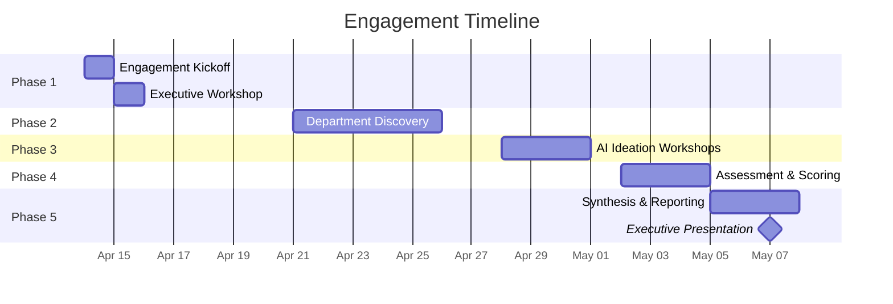

# Engagement Tracker: [Engagement Name]

## Engagement Overview

_Brief description of the engagement scope, objectives, and expected outcomes. Written at kickoff and updated as scope evolves._

## Timeline

## Progress Dashboard

### Phase Status

| Phase | Status | Key Metric | Notes |
|---|:---:|---|---|
| 1. Kickoff & Exec Workshop | ⬜ | | |
| 2. Department Discovery | ⬜ | _0/0 teams_ | |
| 3. AI Ideation | ⬜ | _0 ideas_ | |
| 4. Assessment & Scoring | ⬜ | _0/0 scored_ | |
| 5. Synthesis & Reporting | ⬜ | | |

### Data Collection Progress

| Pillar | Teams Assessed | Capabilities Mapped | Ideas Submitted |
|---|:---:|:---:|:---:|
| _Pillar 1_ | _0/0_ | _0_ | _0_ |
| _Pillar 2_ | _0/0_ | _0_ | _0_ |
| _Pillar 3_ | _0/0_ | _0_ | _0_ |

### Status Legend

| Icon | Meaning |
|:---:|---|
| ⬜ | Not started |
| 📅 | Scheduled |
| 🔄 | In progress |
| ✅ | Complete |
| ⏸️ | On hold |
| ⚠️ | At risk |

## Key Decisions & Changes

_Log significant decisions, scope changes, or pivots during the engagement._

| Date | Decision | Rationale | Impact |
|---|---|---|---|
| _YYYY-MM-DD_ | _What was decided_ | _Why_ | _Effect on scope/timeline_ |

## Open Questions

_Track unresolved questions that need answers to proceed._

| # | Question | Raised By | Date Raised | Status | Resolution |
|---|---|---|---|:---:|---|
| 1 | _Question_ | _Name_ | _Date_ | ⬜ | |

## Risks & Issues

| # | Description | Type | Severity | Owner | Mitigation | Status |
|---|---|:---:|:---:|---|---|:---:|
| 1 | _Description_ | _Risk / Issue_ | _H / M / L_ | _Name_ | _Action_ | ⬜ |

## Meeting Notes

### [Date] — [Meeting Title]

**Attendees:** _List_

**Key Points:**
- _Point 1_
- _Point 2_

**Actions:**
- [ ] _Action 1 — Owner — Due date_
- [ ] _Action 2 — Owner — Due date_

---

# Guidance

## How to Use This Tracker

This is the **central coordination document** for an engagement. Update it after every workshop, session, or significant milestone.

### When to Update

| Event | What to update |
|---|---|
| After each workshop/session | Phase status, `sessions_completed`, `artifacts_completed`, meeting notes |
| When a team card is submitted | `completed_team_cards`, Data Collection Progress table |
| When an idea is submitted | `ideas_submitted`, Data Collection Progress table |
| When scoring is complete | `ideas_scored`, `ideas_approved/deferred/rejected` |
| When scope changes | Scope section, Key Decisions log |
| Weekly (recommended) | `overall_completion_pct`, Risks & Issues |

### Calculating Overall Completion

A simple weighted model:

| Phase | Weight | Completion metric |
|---|:---:|---|
| Phase 1 | 10% | Completed = company profile delivered |
| Phase 2 | 30% | % of teams assessed |
| Phase 3 | 20% | All planned workshops completed |
| Phase 4 | 25% | % of ideas scored and reviewed |
| Phase 5 | 15% | Reports generated and presented |

### Tips

- **Keep meeting notes brief** — capture decisions and actions, not transcripts
- **Update the Gantt chart** as dates shift — this is often the first thing stakeholders look at
- **Log scope changes formally** — scope creep is the #1 risk in assessment engagements
- **Track risks proactively** — a risk logged early with a mitigation plan is manageable; a surprise is not
